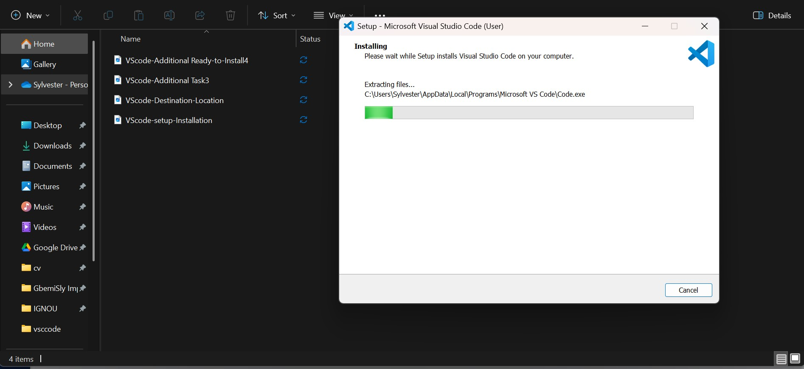
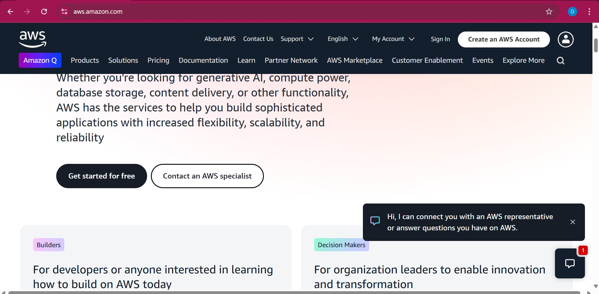
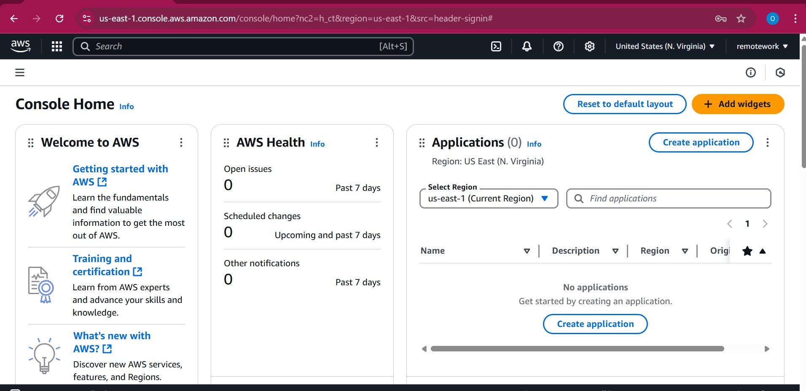

# Tech-Environment-Setup

This installation guide is designed to help DevOps students like me set up all the essential tools and accounts I need. It provides clear, step-by-step instructions for installing key software like Git, Visual Studio Code (VS Code), and VirtualBox, as well as setting up important accounts such as AWS and GitHub.

 ## Tools needed to be Installed include the following:

 1. Visual Studio code (VScode)
 2. Git
 3. VirtualBox
 4. Ubuntu on Virtual box

 ## Accounts that are compulsory for this course are:

 1. GitHub
 2. AWS

How I installed Visual Studio Code (VS Code)

## Steps in installing VScode

Visual Studio Code (VS Code) is a free, lightweight, and powerful source code editor developed by Microsoft. It supports multiple programming languages, including Python, JavaScript, C++, and more. VS Code offers features like IntelliSense (smart code suggestions), debugging tools, Git integration, and a vast library of extensions to enhance functionality. Its user-friendly interface and cross-platform compatibility (Windows, macOS, and Linux) make it a popular choice for developers.

I visited the [official website](https://code.visualstudio.com/download), see the image below: 

then I proceeded to downloading the setup

from this point I acccepted the agreement and it took the installation to the selecting a destination

# NEXT: Git

Git is a free and open-source version control system designed to track changes in code, making collaboration easier for developers. Created by Linus Torvalds in 2005, Git allows multiple people to work on a project simultaneously, manage different versions of files, and merge changes efficiently. It is widely used in software development, especially with platforms like GitHub, GitLab, and Bitbucket, enabling smooth teamwork, backup, and deployment of code.

## Downloaded the setup  from:

[Git Download](https://git-scm.com/downloads)

This took me to the landing page:

## Virtual Box

VirtualBox is a free and open-source virtualization software developed by Oracle. It allows users to create and run multiple virtual machines (VMs) on a single physical computer. Each VM operates as an independent system, running its own operating system (Windows, Linux, macOS, etc.) alongside the host OS.

### Visited the [official website](https://www.virtualbox.org/wiki/Downloads) 
to download the setup:

# Ubuntu: A Brief Overview
Ubuntu is a free and open-source Linux-based operating system developed by Canonical Ltd. It is one of the most popular Linux distributions, known for its user-friendliness, stability, and security. Ubuntu is widely used for personal computing, servers, cloud computing, and IoT devices.

## Downloading and Installing Ubuntu

This [Ubuntu downlaod](https://www.ubuntu.com/download/desktop) grant me access to the setup at the landing page

# Next: GitHub Account Creation

GitHub is a cloud-based platform for version control and collaborative software development. It is built around Git, an open-source version control system created by Linus Torvalds. GitHub allows developers to store, manage, and track changes to code while collaborating with others in real time.

From the [GitHub link](https://github.com/) I arrived at the landing page:

then I proceeded to login becuase I already have an account:

login successfully and landed at the home page:

# AWS Account Creation

From the [AWS Link]() provided:

Because I already have an account i then login:

